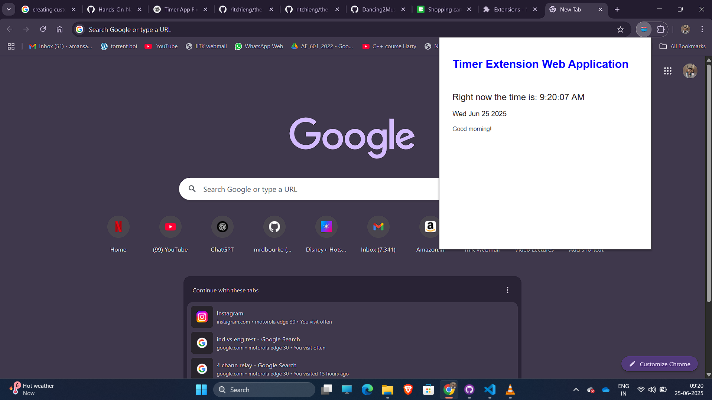
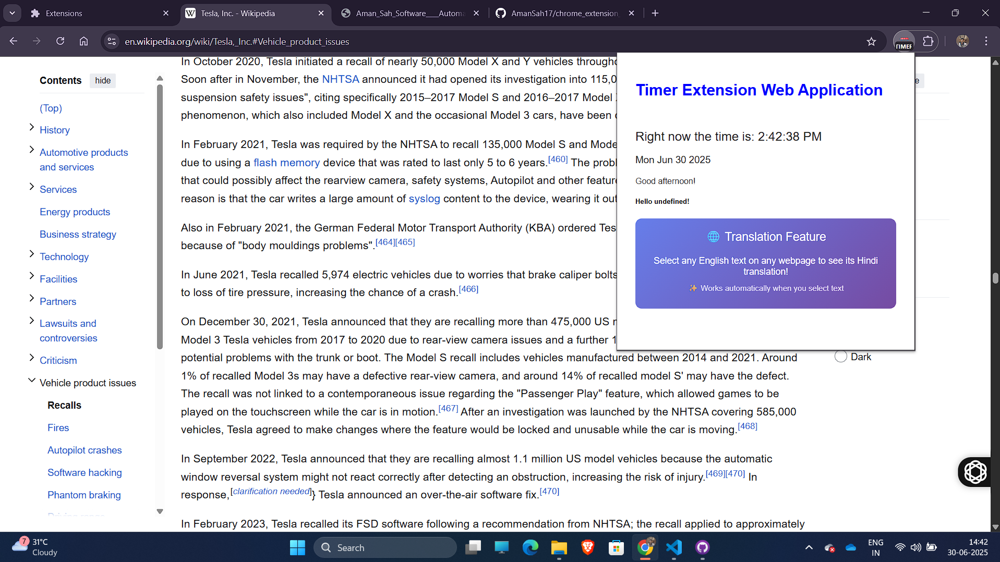
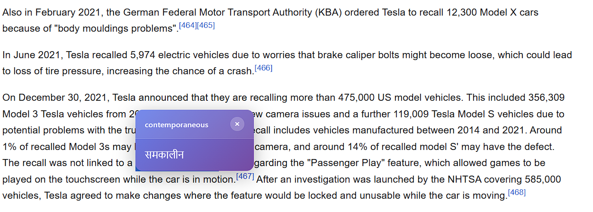

# 🌐 Hindi Translation Chrome Extension

[](https://github.com/AmanSah17/chrome_extension_react)
[](https://developer.mozilla.org/en-US/docs/Web/JavaScript)
[](https://cloud.google.com/translate)
[](https://opensource.org/licenses/MIT)

> **Instantly translate English text to Hindi with a interactive popup interface**


## ✨ Features

- 🚀 **Instant Translation** - Select English text and get immediate Hindi translation
- 🎨 **Beautiful UI** - Modern gradient popup with smooth animations
- ⚡ **Lightning Fast** - Optimized for performance with minimal resource usage
- 🌍 **Universal** - Works on any website across the internet
- 🔒 **Secure** - Uses Google Cloud Translate API for accurate translations
- 📱 **Responsive** - Adapts to different screen sizes and devices
- ⏰ **Smart Timing** - Auto-disappears after 5 seconds or manual close
- 🎯 **Smart Detection** - Only translates English text (filters out other languages)

## 🎬 Demo & Screenshots

### 📸 Extension in Action

<div align="center">

| Step | Screenshot | Description |
|------|------------|-------------|
| **1. Initial Setup** |  | Extension popup showing current time and translation feature info |
| **2. Text Selection** |  | Select any English text on any webpage |
| **3. Translation Result** |  | Beautiful popup showing Hindi translation |

</div>

### 🔄 How it Works:

1. **📝 Select Text**
   - Highlight any English word or phrase on any webpage
   - Works on news sites, blogs, social media, documentation, etc.

2. **⚡ Instant Translation**
   - Beautiful popup appears near your selected text
   - Shows original English text and Hindi translation
   - Powered by Google Cloud Translate API

3. **🎨 Beautiful Interface**
   - Modern gradient design with smooth animations
   - Responsive popup that adapts to screen size
   - Clean typography for easy reading


### ✨  Demo Features:

- **🌍 Universal Compatibility** - Works on any website
- **🚀 Lightning Fast** - Instant translations without page reload
- **📱 Mobile Friendly** - Responsive design for all devices
- **🔒 Secure** - No data stored locally, direct API communication
- **🎯 Smart Detection** - Only translates English text (max 50 characters)

## 🚀 Quick Start

### Prerequisites

- Google Chrome Browser (Version 88+)
- Active internet connection for translations

### Installation

#### Method 1: Load Unpacked Extension (Developer Mode)

1. **Download the Extension**
   ```bash
   git clone https://github.com/AmanSah17/chrome_extension_react.git
   cd chrome_extension_react
   ```

2. **Enable Developer Mode**
   - Open Chrome and navigate to `chrome://extensions/`
   - Toggle **"Developer mode"** in the top-right corner

3. **Load the Extension**
   - Click **"Load unpacked"**
   - Select the downloaded `chrome_extension_react` folder
   - The extension will appear in your extensions list

4. **Pin the Extension** (Optional)
   - Click the puzzle piece icon in Chrome toolbar
   - Pin the "My Chrome Extension" for easy access

#### Method 2: Chrome Web Store (Coming Soon)
*This extension will be available on the Chrome Web Store soon!*

## 📖 How to Use

### 🎯 Step-by-Step Visual Guide

#### Step 1: Extension Setup
<div align="center">

<p><em>Click the extension icon to see the main popup with current time and translation feature info</em></p>
</div>

#### Step 2: Select English Text
<div align="center">

<p><em>Highlight any English word or phrase on any webpage (up to 50 characters)</em></p>
</div>

#### Step 3: View Translation
<div align="center">

<p><em>Beautiful popup appears instantly with Hindi translation and original text</em></p>
</div>

### 💡 Basic Usage Tips

1. **Navigate** to any webpage with English text
2. **Select** any English word or phrase (up to 50 characters)
3. **View** the instant Hindi translation in a beautiful popup
4. **Close** the popup by clicking outside, pressing × button, or wait 5 seconds

### 🌟 Pro Tips

- **Double-click** words for quick selection
- **Drag to select** phrases and sentences
- **Works on PDFs** opened in Chrome browser
- **Try different websites** - news, blogs, social media, documentation
- **Mobile responsive** - works on Chrome mobile browser

### Advanced Features

- **Context Menu**: Right-click selected text → "Translate to Hindi"
- **Keyboard Shortcuts**: Select text and the translation appears automatically
- **Multiple Selections**: Translate different words on the same page
- **Responsive Design**: Works on mobile and desktop Chrome

## 🛠️ Technical Details

### Built With

- **Manifest V3** - Latest Chrome Extension standard
- **Vanilla JavaScript** - Pure ES6+ for optimal performance
- **Google Cloud Translate API** - Professional translation service
- **CSS3** - Modern styling with gradients and animations
- **Chrome Extension APIs** - Storage, Content Scripts, Background Scripts

### Architecture

```
chrome_extension_react/
├── manifest.json          # Extension configuration
├── content.js            # Main translation logic
├── content.css           # Popup styling
├── popup.html            # Extension popup interface
├── popup.js              # Popup functionality
├── popup.css             # Popup styling
├── options.html          # Settings page
├── options.js            # Settings functionality
├── background.js         # Background processes
├── test.html             # Testing page
└── icon-food.png         # Extension icon
```

### API Integration

- **Google Cloud Translate API v2**
- **Real-time translation** with error handling
- **Rate limiting** and optimization
- **Secure API key management**

## ⚙️ Configuration

### API Setup

1. **Get Google Cloud Translate API Key**
   - Visit [Google Cloud Console](https://console.cloud.google.com/)
   - Enable the Cloud Translation API
   - Create credentials and get your API key

2. **Configure the Extension**
   - The API key is already configured in the extension
   - For production use, consider implementing secure key storage

### Customization

You can customize the extension by modifying:

- **Translation Languages**: Edit `source` and `target` in `content.js`
- **Popup Styling**: Modify `content.css` for different themes
- **Text Limits**: Adjust character limits in the content script
- **Auto-close Timer**: Change timeout duration in `createTranslationPopup()`

## 🔧 Development

### Local Development

1. **Clone the Repository**
   ```bash
   git clone https://github.com/AmanSah17/chrome_extension_react.git
   cd chrome_extension_react
   ```

2. **Make Changes**
   - Edit the source files as needed
   - Test your changes locally

3. **Reload Extension**
   - Go to `chrome://extensions/`
   - Click the reload button on your extension
   - Test the changes on any webpage

### Testing

- Use the included `test.html` file for quick testing
- Test on various websites to ensure compatibility
- Check console for any errors or warnings

## 🤝 Contributing

We welcome contributions! Here's how you can help:

1. **Fork** the repository
2. **Create** a feature branch (`git checkout -b feature/AmazingFeature`)
3. **Commit** your changes (`git commit -m 'Add some AmazingFeature'`)
4. **Push** to the branch (`git push origin feature/AmazingFeature`)
5. **Open** a Pull Request

### Contribution Guidelines

- Follow existing code style and conventions
- Add comments for complex logic
- Test thoroughly before submitting
- Update documentation if needed

## 📝 License

This project is licensed under the MIT License - see the [LICENSE](LICENSE) file for details.

## 👨‍💻 Author

**Aman Sah**
- GitHub: [@AmanSah17](https://github.com/AmanSah17)
- Email: amansah1717@gmail.com

## 🙏 Acknowledgments

- Google Cloud Translate API for translation services
- Chrome Extension documentation and community
- Open source community for inspiration and support

## 📞 Support

If you encounter any issues or have questions:

1. **Check** the [Issues](https://github.com/AmanSah17/chrome_extension_react/issues) page
2. **Create** a new issue with detailed description
3. **Contact** the developer directly

---

<div align="center">

**⭐ Star this repository if you found it helpful!**

Made with ❤️ by [Aman Sah](https://github.com/AmanSah17)

</div>
